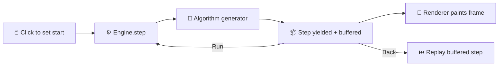

#<div align="center">

# OptiViz

**An interactive playground for watching numerical optimization algorithms think.**

[](https://iccha06.github.io/OptiViz/)
[](https://github.com/iccha06/OptiViz)
[](https://github.com/iccha06/OptiViz)
[](https://github.com/iccha06/OptiViz)

<br/>

**[🚀 Try the live demo →](https://iccha06.github.io/OptiViz/)**

</div>

---

## 🧭 What is this?

OptiViz lets you **watch optimization algorithms converge, step by step**, instead of just reading about them. Drop a point on a surface, curve, or linear program — then step, run, or scrub through every iteration in real time.

Pure JavaScript, HTML, and CSS. No build step, no backend, no npm install.

<br/>

## ✨ Features

| | |
|---|---|
|  **4 algorithms** | Gradient Descent · Newton's Method (2D) · Newton–Raphson (1D roots) · Simplex Method |
|  **Compare mode** | Run two algorithms side-by-side on the same surface with live metrics |
|  **Race mode** | Start both together and see who converges first |
|  **Click-to-start** | Set your starting point anywhere on the surface |
|  **Step / Run / Back** | Walk through iterations one at a time or animate continuously |
|  **Live metrics** | Iteration count, `f(x,y)`, gradient norm `‖∇f‖`, convergence rate |
|  **Tunable learning rate** | See how step size changes the descent path |
|  **Multiple surfaces** | Bowl · Saddle · Rosenbrock valley |

<br/>

## 🖼️ Surfaces & Test Functions

<div align="center">

| Surface | Equation | Good for |
|---|---|---|
|  Bowl | `x² + y²` | Watching clean convergence |
|  Saddle | `x² − y²` | Seeing why gradient descent can struggle |
|  Rosenbrock | classic "banana" valley | Stress-testing algorithms |

| 1D Root-Finding Function | Notes |
|---|---|
| `x³ − x − 2` | Standard Newton–Raphson case |
| `cos(x) − x` | Transcendental fixed point |
| `x⁵ − 3x + 1` | Contains a flat-tangent trap |

</div>

<br/>

## 🏗️ How it's built

Each algorithm is a **JavaScript generator** that yields one step at a time — that single design choice is what makes stepping, scrubbing, and side-by-side racing all work without duplicated logic.

```
src/
├── algorithms/     one generator per algorithm — pure math, no UI knowledge
├── engine.js       drives a generator, buffers history for step/back/replay
└── render.js       draws whatever step the engine is currently on
```

<div align="center">



</div>

Adding a new method is mostly just **writing a new generator** — the engine and renderer don't need to change.

<br/>

## 🚀 Getting Started

```bash
git clone https://github.com/iccha06/OptiViz.git
cd OptiViz
```

Then just open `index.html` in your browser — or serve it locally:

```bash
python3 -m http.server 8000
# → http://localhost:8000
```

No `npm install`. No build. No waiting. 🎉

<br/>

## 🕹️ Usage

1.  Pick an algorithm — Gradient Descent, Newton's Method, Newton–Raphson, Simplex, or Compare
2.  Choose a surface, function, or linear program
3.  Click the canvas to set your starting point
4.  Hit **Step** to go one iteration at a time, or **Run** to animate
5.  Watch the metrics panel update live
6. In **Compare** mode, configure Run A and Run B independently and race them

<br/>

## 🧩 Adding Your Own Algorithm

```
1. Write a generator in src/algorithms/ that yields
   { position, value, gradient, ... } each step

2. Register it in the algorithm selector in index.html

3. Done — engine.js and render.js drive it automatically
```

<br/>

## 🗺️ Roadmap

- [ ] Conjugate Gradient, BFGS, Momentum/Adam variants
- [ ] More surfaces & test functions
- [ ] Exportable convergence plots

<br/>

## 📄 License

No license is currently published in this repository. Open an issue or contact the owner before reusing.

<br/>

<div align="center">

Built  by **[iccha06](https://github.com/iccha06)**

⭐ *If you find this useful, consider starring the repo!*

</div>
